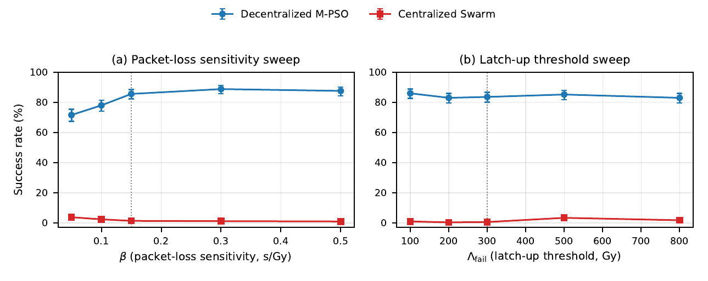
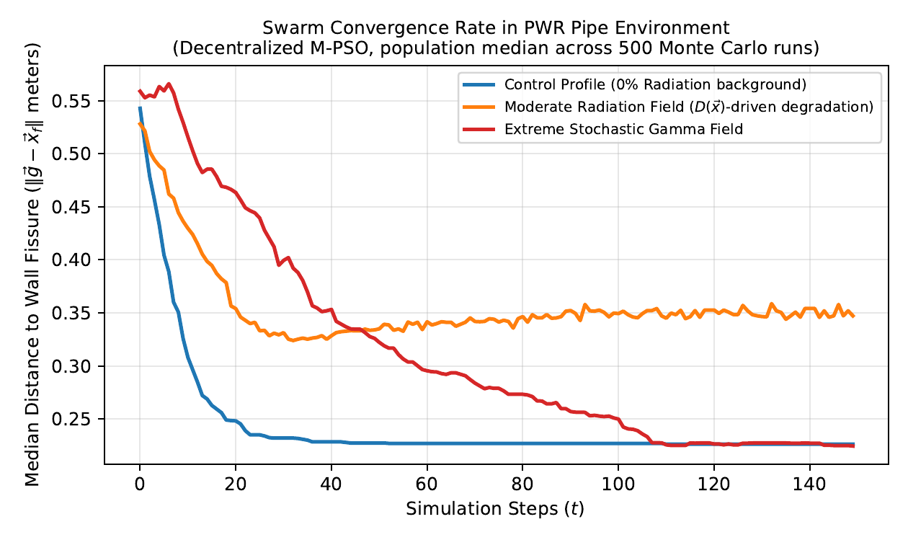
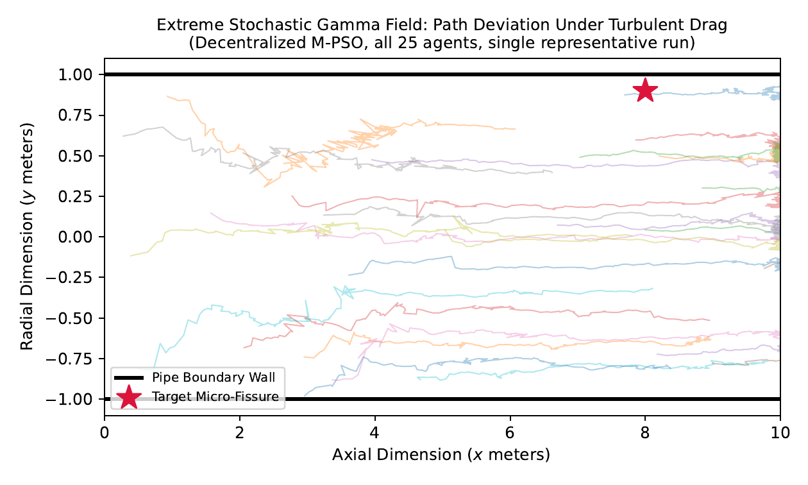

# Results guide

## Main manuscript campaign

Table II of the camera-ready manuscript reports 500 independent trials for each architecture/profile pair. Under the modeled Extreme profile:

| Architecture | Success | Wilson 95% CI | Non-trivial success |
|---|---:|---:|---:|
| Decentralized M-PSO | 84.0% | [80.5, 87.0] | 79.9% |
| Centralized, static leader | 3.0% | [1.8, 4.9] | 0.8% |
| Centralized, re-election | 1.8% | [0.9, 3.4] | 0.8% |
| Canonical PSO | 29.6% | [25.8, 33.7] | 12.9% |

The selected `N=25` operating point is supported by the swarm-size sweep: modeled success increases from 59.4% at `N=10` to 83.4% at `N=25`, while cumulative swarm dose grows with population size.

## Communication-fragility campaign

The packet-loss-sensitivity and latch-up-threshold sweeps are archived in:

- `results/table_beta_sweep.csv`
- `results/table_lambdafail_sweep.csv`

Across `Lambda_fail = 100-800 Gy`, decentralized success remains 83.0-86.0%. The static-leader comparator remains at 0.4-3.4%, even while measured leader latch-up falls substantially at the hardened end of the sweep. Within this model, reducing one permanent-failure mechanism does not remove the centralized information bottleneck.

## Single-hot-standby campaign

The later hardened-baseline campaign has its own SHA-256 campaign identities and is therefore an independent replication, not a reuse of Table II's exact random streams.

| Architecture | Success [Wilson 95% CI] | Failover completed |
|---|---:|---:|
| Decentralized M-PSO | 87.0% [83.8, 89.7] | n/a |
| Static leader | 1.8% [0.9, 3.4] | n/a |
| Re-election | 4.6% [3.1, 6.8] | n/a |
| Hot standby, h=1 | 1.4% [0.7, 2.9] | 81.2% |
| Hot standby, h=3 | 1.6% [0.8, 3.1] | 80.4% |
| Hot standby, h=5 | 0.6% [0.2, 1.7] | 78.6% |

The nominal `h=3` comparison gives an 85.4 percentage-point difference between decentralized M-PSO and the single-hot-standby baseline (reported Wald `z=27.18`, approximate 95% difference interval [82.25, 88.55] points).

The mechanism claim is deliberately bounded: promotion changes coordinator identity, but reporting and replication still traverse the same range- and radiation-gated communication graph. This campaign does not test multi-standby, quorum, relay-assisted, or physically independent side-channel designs.

## Why nominal values can differ across files

Several nominal decentralized campaigns appear in the paper and repository. Their 83.4-87.0% success estimates use the same nominal physics but different documented condition identities, so they receive different deterministic random streams. Their Wilson intervals overlap. They are independent stability checks, not duplicate rows expected to be numerically identical.

## Visual behavior

